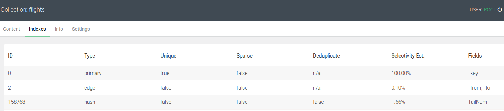

# arangodb

[Course Materials & Resources](https://arangodb.com/learn/first-day/udemy/)  

Notes from arangodb course

Run arangodb via terminal: `arangosh`

**Section 3**  
**16,17 - Indexes**  
Simple query from section-3/filter.aql takes 597,228 ms (hundreds, not thousands). Number of times query had to iterate through the flights collection is 286463 (total number of edges in the flights collection) to return only 97 results. This is inefficient and can be improved by creating an index.

After creating above index the same query runs in 1,250 ms.

**Conclusion**: Indexes fix the problem of slow running queries.

**18 - GeoJSON**  

GeoJSON is a format for geographical features > see *section3/geoJson.aql* with examples.

**19 - Joins**  

- Joins represent relationship between multiple collections.
- Instead of JOIN keyword (used in SQL), join is performed using nested FOR loops > *secion3/join.aql*.

**20 - COLLECT**  
- grouping of results

**21 - AGGREGATE**  
- Optimizes resource utilization

